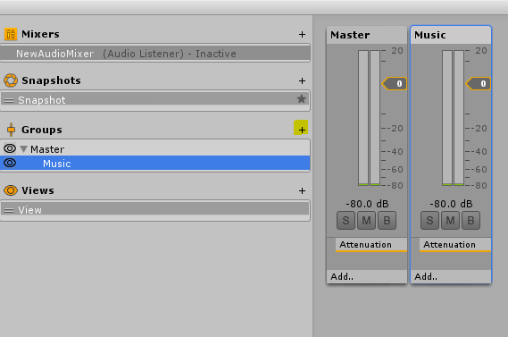
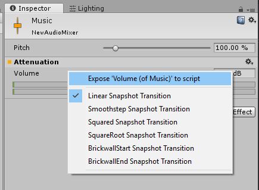
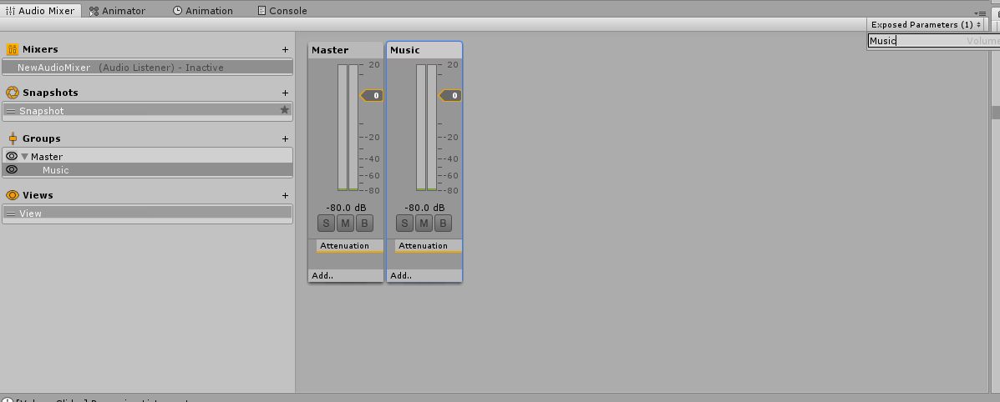

# SoundSystem For Unity
Simple and quickly sound system easy to use for Unity 3D.

With this Asset you can deploy a complete Sound System with a few steps.

## Getting Started
Begin to import the Asset and Packages folders in you proyect folder.

Later include the SoundSystemBankManager prefab to your hierarchy.

### Creating the AudioMixers
To begin you need to create your AudioMixer and configure this with the group what you want.



Later, configure it adding the volume values like Exposed Parameters, for do this, click in one group and in Inpect tab do a right click
in the Volume label and click in Expose.
 



Name it like the group for the correct function of the System.



Having this, the next thing is configure the SoundTypes.

### Creating the SoundTypes
By default this proyect had insided two commons SoundTypes (GeneralSounds and UISounds) if you want to create your own you need the next things:

* SoundType
* SoundBank

#### SoundType
For this, you can create your own script inheriting from the SoundType class and complete the variables inhered from it or you can copy and paste one
of the SoundTypes examples like GeneralSound or UISound and change the variables names.

If you create the script from scratch, you need to create a Enum with the values that you want. This values correspond with the sounds what you'll use in 
the type. For example, this is the enum for GeneralSoundType:

```csharp
public enum GeneralSoundType
  {
    MainMenu,
    Screen1,
    Screen2,
    Credits
  }
```

In this class you need to complete a method called GetAudioClip(Enum soundType), you can copy and paste from one of the examples.

#### Sound Bank
For create this one, you need copy and paste GeneralSoundBankSO.cs or UISoundBankSO.cs and change the variables names for what you want and modify the CreateAssetMenu attribute.

This classes implement the InspectMethod classes created by me. This classes are used for execute some methods in the Inpector, for do this, you only
need to put the next atribute in the method to inspect:

```
[InspectMethod]
```

In the classes General/UISoundBankSO are used for init the SoundList with the enum values of the SoundType (More easy!).

After create the Bank, now you can create the Scriptable Objects of it, by default the path is:

Do right click on your project tab and use 

```
Create -> SoundSystem -> Scriptable Object -> Audio -> [Your bank]
```

Having those classes completed, now you can work with this Asset!

First, we need set up the SoundSystemBankManager gameobject imported before:

* Add the AudioMixer created in the first step to AudioMixerMaster in SoundSystemBankManager gameobject.
* Add the SoundTypes to the SoundType list.

And that's all!

To play an audio you only need to use this line:

```csharp
SoundSystemBankManager.Instance.PlayAudio(Enum soundTypeEnum, bool stopOnSceneChange)
```

*stopOnSceneChange is use for keep or not the sound that plays when the scene change.*

## Volume Sliders
Do you need to change the volume in the options menu? This is going to be easy!

You only need to create a VolumeSlider!

Use in your hierarchy:

```
Create -> UI -> VolumeSlider
```

And that's all!

The enum showed is filled with the SoundTypes putted in the soundtype list on the SoundSystemBankManager, you only need to put what you want to modify.
